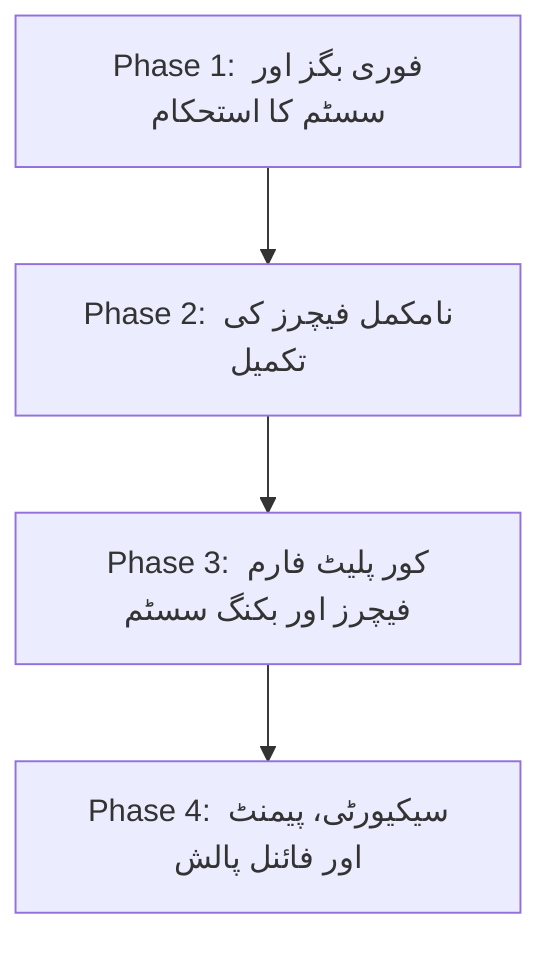

# 🗺️ Wonderlust — Phase-Wise Project Improvement Plan

یہ دستاویز **Wonderlust** پروجیکٹ کے موجودہ بگز کو فکس کرنے، نامکمل فیچرز کو مکمل کرنے، اور اسے ایک مکمل پروفیشنل پلیٹ فارم (Airbnb Clone) میں تبدیل کرنے کے لیے مرحلہ وار پلان فراہم کرتی ہے۔

---

## 📑 فہرستِ مراحل (Roadmap Overview)

---

## 🔴 فیز 1: فوری بگز اور سسٹم کا استحکام (Critical Bug Fixes & Stability) — [مکمل ✅]
**ہدف:** تمام ایسے مسائل کو حل کرنا جو رن ٹائم پر سرور کریش یا 500 ایررز پیدا کرتے ہیں۔

- [x] **1.1 ریویو اتھرائزیشن بگ درست کرنا (`ReferenceError`)**
  - **فائل:** `middlewares.js`
  - **تبدیلی:** `isReviewAuthor` فنکشن میں متغیر کے نام کی درستگی اور نل چیکس لگا دیے گئے۔
- [x] **1.2 ملٹر اور ویلیڈیشن میڈل ویئر کی ترتیب درست کرنا**
  - **فائل:** `routes/listing.js`
  - **تبدیلی:** `POST /listings` میں `upload.single(...)` کو `validateListing` سے پہلے رکھ دیا گیا تاکہ `req.body` ویلیڈیشن سے پہلے دستیاب ہو۔
- [x] **1.3 Joi ویلیڈیشن اسکیما کو اپڈیٹ کرنا**
  - **فائل:** `Scehma.js`
  - **تبدیلی:** `listingSchema` میں تمام 9 کیٹیگریز (`category`) کو ویلیڈیٹ کرنے کی سپورٹ شامل کر دی گئی۔
- [x] **1.4 نل (Null) کریش سے بچاؤ کے حفاظتی اقدامات**
  - **فائلیں:** `views/listings/show.ejs` اور `public/js/map.js`
  - **تبدیلی:** `geometry.coordinates`، `Listing.owner`، اور `review.author` پر نل چیکس لگا دیے گئے تاکہ پیج کبھی کریش نہ ہو۔
- [x] **1.5 ڈیٹا بیس سیڈنگ اسکرپٹ فکس کرنا**
  - **فائل:** `init/index.js`
  - **تبدیلی:** `dotenv` روٹ سے لوڈ کیا گیا، `ATLASDB_URL` سیٹ کی گئی، اور ڈیٹا بیس سے ڈائنامک یوزر منسلک کیا گیا۔
- [x] **1.6 ایکسپریس سیشن کی اسپیلنگ درست کرنا**
  - **فائل:** `app.js`
  - **تبدیلی:** `saveunintialized` کی ٹائپو کو ٹھیک کر کے `saveUninitialized: true` کر دیا گیا۔

---

## 🟡 فیز 2: نامکمل فیچرز کی تکمیل (Incomplete Features Completion) — [مکمل ✅]
**ہدف:** وہ فیچرز جو آدھے بنے ہوئے ہیں یا نامکمل فنکشنلٹی فراہم کر رہے ہیں انہیں مکمل کرنا۔

- [x] **2.1 لسٹنگ ایڈٹ فارم میں کیٹیگری شامل کرنا**
  - **فائل:** `views/listings/update.ejs`
  - **تبدیلی:** ایڈٹ فارم میں تمام 9 کیٹیگریز کا ڈراپ ڈاؤن شامل کر دیا گیا اور موجودہ کیٹیگری کو پہلے سے منتخب (`selected`) رکھا گیا۔
- [x] **2.2 لسٹنگ اپڈیٹ پر میپ لوکیشن دوبارہ جیوکوڈ کرنا**
  - **فائل:** `controllers/listings.js`
  - **تبدیلی:** لسٹنگ ایڈٹ کے دوران لوکیشن یا ملک تبدیل ہونے پر MapTiler API کے ذریعے نئے کوآرڈینیٹس نکال کر `Listing.geometry` کو اپڈیٹ کیا گیا۔
- [x] **2.3 کلاؤڈ انری (Cloudinary) سے پرانی تصاویر صاف کرنا**
  - **فائل:** `controllers/listings.js`
  - **تبدیلی:** جب کوئی لسٹنگ ڈیلیٹ یا نئی تصویر کے ساتھ اپڈیٹ کی جائے تو پرانی تصویر کو `cloudinary.uploader.destroy()` کے ذریعے کلاؤڈ سے ڈیلیٹ کر دیا جاتا ہے۔
- [x] **2.4 یونیفائیڈ سرچ اور فلٹرز (Unified Search & Filtering)**
  - **فائلیں:** `controllers/listings.js`, `views/listings/index.ejs`, `views/includes/navbar.ejs`
  - **تبدیلی:** 
    - تمام الگ فلٹرز کو یونیفائیڈ کوری میں بدلا گیا، ایکٹیو کیٹیگری کو ہائی لائٹ کیا گیا اور کیٹیگری + قیمت + کی ورڈ کو بیک وقت فلٹر کرنے کی سہولت دی گئی۔
- [x] **2.5 اصلی پرائیویسی اور ٹرمز پیجز بنانا**
  - **فائلیں:** `views/Privacy.ejs`, `views/Terms.ejs`, `app.js`, `views/includes/footer.ejs`
  - **تبدیلی:** پروفیشنل پرائیویسی پالیسی اور ٹرمز آف سروس کے مکمل ڈیزائن شدہ پیجز بنائے گئے اور فوٹر میں لنک کیے گئے۔
- [x] **2.6 ریویوز کو ایڈٹ کرنے کا فیچر**
  - **فائلیں:** `routes/review.js`, `controllers/review.js`, `views/listings/show.ejs`
  - **تبدیلی:** ریویو اتھر کے لیے ریویو کارڈ پر "Edit" بٹن، کولیپسبل ایڈٹ فارم اور بیک اینڈ پر `PUT` روٹ شامل کر دیا گیا۔

---

## 🟢 فیز 3: بنیادی پلیٹ فارم فیچرز (Core Airbnb Features) — [مکمل ✅]
**ہدف:** Wonderlust کو محض ایک براؤزنگ ویب سائٹ کے بجائے مکمل بکنگ پلیٹ فارم بنانا۔

- [x] **3.1 یوزر پروفائل اور ڈیش بورڈ (User Dashboard)**
  - **ماڈیول:** `/profile`
  - **خصوصیات:**
    - "My Listings": یوزر کی تمام پوسٹ کردہ لسٹنگز کا نظم و نسق، فوری ایڈٹ و ڈیلیٹ۔
    - "My Trips": یوزر کی بکنگز کی تاریخ اور اسٹیٹس۔
    - "My Reviews": یوزر کے دیے گئے ریویوز۔
    - کسٹم اواتار، ای میل اور کاؤنٹرز کے ساتھ ڈیش بورڈ۔
- [x] **3.2 بکنگ اور ریزرویشن سسٹم (Booking & Reservation System)**
  - **ماڈل:** `Models/booking.js` (listing, user, checkIn, checkOut, guests, totalNights, pricePerNight, tax, totalPrice, status)
  - **روٹس اور کنٹرولرز:**
    - `POST /bookings/:id`: تاریخوں اور مہمانوں کی بنیاد پر نائٹس، 18% GST اور فائنل قیمت کا لائیو حساب اور بکنگ کنفرمیشن۔
    - `POST /bookings/:id/cancel`: بکنگ کینسل کرنے کی سہولت۔
    - `views/bookings/index.ejs`: تمام بکنگز کا کارڈ ویو۔
    - `views/listings/show.ejs`: لسٹنگ پیج پر Airbnb طرز کا لائیو کیلکولیٹر بکنگ ویجیٹ۔
- [x] **3.3 وش لسٹ / فیورٹس سسٹم (Wishlist / Save to Favorites)**
  - **خصوصیات:**
    - `Models/user.js` میں `wishlist` کا اضافہ۔
    - لسٹنگ کارڈز اور شو پیج پر ہارٹ (❤️) ٹوگل بٹن۔
    - `views/users/wishlist.ejs`: تمام پسندیدہ لسٹنگز کا مینیجر۔

---

## 🔵 فیز 4: ایڈوانسڈ فیچرز، سیکیورٹی اور پالش (Security, Payments & Polish) — [مکمل ✅]
**ہدف:** پروڈکشن ریڈی بنانا، سیکیورٹی مضبوط کرنا اور ادائیگیوں کی سہولت دینا۔

- [x] **4.1 پیمنٹ و رسید تجربہ (Payment & Receipt Experience)**
  - بکنگز پر محفوظ ادائیگی کا اسٹیٹس، رسید کا پاپ اپ موڈل اور پرنٹ ایبل انوائس جنریٹر۔
- [x] **4.2 سیکیورٹی اور ریٹ لمٹنگ (Security Hardening)**
  - لاگ ان اور سائن اپ روٹس پر بروٹ فورس پروٹیکشن کے لیے `express-rate-limit` کا نفاذ۔
  - گوگل لاگ ان کے ری ڈائریکٹ یو آر ایل کو `process.env.GOOGLE_CALLBACK_URL` کے متحرک متغیر کے تحت لایا گیا۔
  - Cloudinary اسٹوریج کنفیگریشن میں `allowed_formats` درست کیا گیا۔
- [x] **4.3 ٹیکس ٹوگل کی لوکل اسٹوریج میں حفاظت (Persistent Tax Display)**
  - `public/js/script.js` میں `localStorage` انٹیگریٹ کر کے ٹیکس ٹوگل کی سیٹنگ کو براؤزنگ اور ریفریش کے دوران برقرار رکھا گیا۔
- [x] **4.4 پیجینیشن اور کارکردگی (Pagination & Performance)**
  - لسٹنگز کے مرکزی پیج پر پیجینیشن (9 فی پیج)، اگلے/پچھلے پیج کے بٹنز اور ایکٹیو پیج نمبرز۔
  - فلٹرز، سرچ اور کیٹیگریز کے ساتھ پیجینیشن کا باہمی ربط۔

---

## 🏁 اختتامی نوٹ (Final Summary)

تمام چاروں فیزز (**Phase 1, Phase 2, Phase 3, Phase 4**) کامیابی کے ساتھ مکمل کر لیے گئے ہیں۔ Wonderlust اب مکمل، مستحکم، اور محفوظ ہو چکا ہے۔
